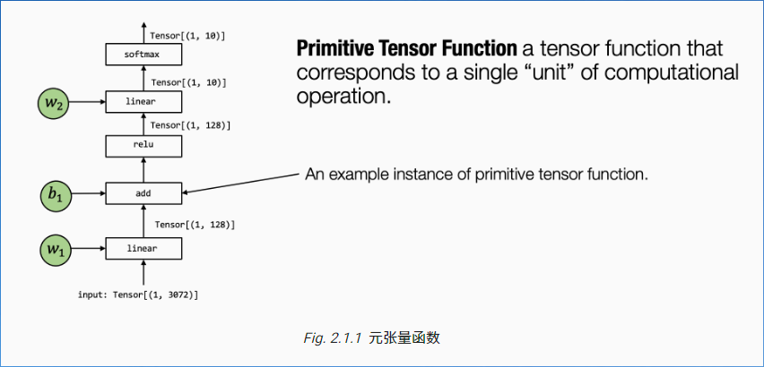
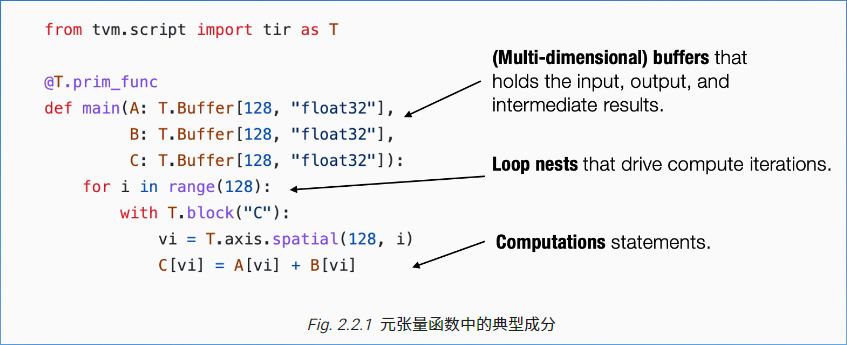

# 张量程序抽象

## 1. 元张量函数

典型的机器学习模型的执行包含许多步将输入张量转化为最终预测的计算步骤，其中的每一步都被称作元张量函数。

张量算子 liner，add，relu和softmax均为元张量函数。

同一个元张量函数有不同抽象的表示，例如 torch.add, numpy.add, 或者用C语言实现的add

许多机器学习框架都提供机器学习模型的编译过程，将元张量函数变换为更为专门针对特定工作和部署环境的函数。

## 2. 张量程序抽象

一个典型的元张量函数实现的抽象包含以下部分：

* 存储数据的多维数组
* 驱动张量计算的循环嵌套
* 计算部分本身的语句

这类抽象成为张量程序抽象。

## 3. 张量程序抽象中的其他结构

我们不能任意地对程序进行变换，例如计算之间会依赖循环顺序，但是大多数的元张量函数具有良好的循环独立性。

张量程序可以将这些额外信息合并为程序的一部分，使得程序变换更加便利。

例如上图中的程序包含了额外的T.axis.spatial 标注，表示 vi这个变量
被映射到循环变量i，而且所有的迭代是独立的。
这样就可以安全的并行或者重排序与vi有关的循环，只要实际执行的时候vi的值从0到128顺序变化。
